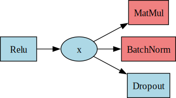

# Data Class
The `Data` class holds the network activations and derivatives of the loss functions w.r.t. these
activations. Their values are transformed by `Module` objects to create values stored in the next
`Data` object in the network.

The following visualization intuitively sums up the types of connections of a `Data` object:
<div align="center">
    <picture>
        
    </picture>
</div>
<br>

A `Data` object's **val** (value) comes from a `Module`. A `Data` object has only 1 **input** as it
can only have 1 source of creation. Therefore the input is a single `Module` object. But its value
can be used for multiple transformations, therefore it can have multiple **outputs**. Thus its
output is a list of `Module` objects.

Each `Data` object should have a unique **ID** so that it can be explicitly accessed. The **shape**
should be specified keeping the batch dimension in mind. The first dimension is always assumed to be
the batch dimension. So if the `Data` is a vector of length 3 its shape = (1, 3) and for a conv
volume of dimensions (C, H, W) its shape = (1, C, H, W). The value and derivative of the data object
are initialized with (1, dim1, dim2, ...) shape but during training any batch size (B, 3) or
(B, C, H, W) can be used. The val and deriv fields are set by the `Net` object to appropriate values
before running the forward and backward passes.

Each `Data` object has its own **learning_rate** and **optimizer**. Thus DeepFusion provides a
strong control over data and the way it is updated during training. A `Data` object's value will be
updated if its in an unfrozen state or that its **is_frozen** attribute is set to False. It can
further be regularized by specifying **regularizer** details.

## Attributes
Based on these features a `Data` object has the following attributes:
|Attribute     |Type           |
|--------------|---------------|
|ID            |str            |
|shape         |tuple[int, ...]|
|val           |npt.NDArray    |
|deriv         |npt.NDArray    |
|is_frozen     |bool           |
|optimizer     |`Optimizer`    |
|learning_rate |float          |
|is_regularized|bool           |
|regularizer   |`Regularizer`  |
|input         |`Module`       |
|outputs       |list[`Module`] |


At any point a `Data` object's state can be accessed by using `print(data_obj)`. A sample output is
as follows:
```python
Data Object
----------------------------------------
ID             : x
shape          : (1, 5)
is_frozen      : False
optimizer      : Adam
learning_rate  : 1e-06
is_regularized : False
regularizer    : None
input          : None
outputs        : []
val            : //
deriv          : //
```

## Methods
`Data` objects have the following methods defined:
- `__init__(self, ID: str, shape: tuple[int, ...], val: npt.NDArray = None,
  is_frozen: bool = True, optimizer_details: dict = DEFAULT_OPTIMIZER_DETAILS,
  learning_rate: float = 1e-6, is_regularized: bool = False,
  regularizer_details: Optional[dict] = None) -> None`:
  Initializes the `Data` instance based on the provided ID, shape, and other optional parameters.
  Raises a `ValueError` if the data is regularized but no regularizer details are provided.

- `update(self) -> None`:
  Updates the value (if not frozen) using steps from the optimizer and regularizer.

- `freeze(self) -> None`**:
  Freezes the `Data` object so that updates to its value will no longer be made.

- `unfreeze(self, optimizer_details: dict = DEFAULT_OPTIMIZER_DETAILS) -> None`:
  Unfreezes the `Data` object to allow updates to be made to its value.

- `clear_grads(self) -> None`:
  Sets the `deriv` attribute to zero.

- `set_regularization(self, regularizer_details: dict) -> None`:
  Regularizes the data using specified regularization strength and function.

- `set_learning_rate(self, learning_rate: float) -> None`:
  Sets the learning rate for the `Data` object.

- `set_optimizer(self, optimizer_details: dict) -> None`:
  Sets an optimizer for the `Data` object that can be used to update the value.

- `__str__(self) -> str`:
  Returns a string representation of the `Data` object based on current attribute values.