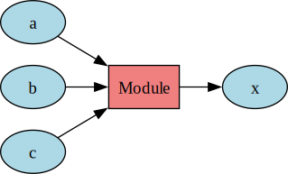

# Module Class
The `Module` class objects perform operations on the values of `Data` objects to produce the
activations in the next layer of the network during the forward pass. During the backward pass it
sets the deriv attributes of the `Data` objects.

The following visualization intuitively sums up the types of connections of a `Module` object:
<div align="center">
    <picture>
        
    </picture>
</div>
<br>

A `Module` object's inputs come from val attribute of the input `Data` objects and it sets the
output `Data` object's val attribute. A `Module` object has only 1 **output** as every
transformation of given inputs must result in a single result, this follows from a function taking
in multiple variables but outputting a single value. Therefore, the **output** is a single `Data`
object. But it can have multiple **inputs** as multiple `Data` object values can be transformed
together. Thus its input is a list of `Data` objects.

Parameters inside `Module` objects are themselves `Data` objects. Dimensions of these parameters are
set implicitly by using the input and output dimensions, eg: `MatMul` does not require the user to
define the shape of the W matrix.

Each `Module` object should have a unique **ID** so that it can be explicitly accessed. Also every
parameter of the module is appropriately given an ID as `modulename_parametername`, Eg: Matmul_W.

Each `Module` object's parameter is a `Data` object and thus has its own **learning_rate** and
**optimizer**.

Each module has an attribute **different_at_train_test** which is set to True for modules that work
differently during training and testing, eg: batch normalization. These modules have an additional
**mode** attribute which can be set to either 'train' or 'test' and the module works appropriately
in the two scenarios. Some modules also have parameters that are regularizable, for eg: matrix
multiplication. For these modules the **is_regularizable** attribute is set to True.


## Types of Modules
Currently the following types of modules are available:
- **general modules**
  - MatMul, Conv2D, Add, Flatten
- **activation_functions**
  - Relu, Sigmoid, Tanh, PRelu, LRelu, ELU
- **loss_functions**
  - MSELoss, LogisticLoss, CrossEntropyLoss, SumLoss
- **normalizations**
  - BatchNorm, LayerNorm
- **dropout**
  - Dropout, InvertedDropout
- **pooling**
  - MaxPool
- **rnn**
  - RNN1, RNN2


## Attributes
Based on features described above a `Module` object has the following attributes:
|Attribute              |Type                     |
|-----------------------|-------------------------|
|ID                     |str                      |
|inputs                 |list[`Data`]             |
|output                 |`Data`                   |
|parameter_list         |list[`Data`]             |
|is_frozen              |bool                     |
|optimizer_details      |dict                     |
|learning_rate          |float                    |
|different_at_train_test|bool                     |
|mode                   |Optional['train', 'test']|
|is_regularizable       |bool                     |
|is_regularized         |Optional[bool]           |
|regularizer_details    |dict                     |

At any point a `Module` object's state can be accessed by using `print(module_obj)`. A sample output
is as follows:
```python
Module Object
----------------------------------------
ID                      : Matmul1
inputs                  : ['x']
output                  : z1
parameter_list          : ['Matmul1_W', 'Matmul1_b']
is_frozen               : False
optimizer_details       : {'optimizer_name': 'Adam', 'hyperparameters': {}}
learning_rate           : 1e-06
different_at_train_test : False
mode                    : None
is_regularizable        : True
is_regularized          : False
regularizer_details     : None
```


## Methods
- `__init__(self, ID: str, inputs: list[Data], output: Data,
  parameter_list: Optional[list[Data]] = None, learning_rate: float = 1e-6, is_frozen: bool = False,
  optimizer_details: dict = DEFAULT_OPTIMIZER_DETAILS)`:
  Initializes Module object based on ID, inputs, output and other optional parameters.
  Raises `ValueError` if input is not a list of Data objects or the output is not a Data object.


- `forward(self)`:
  Sets the value attribute for the output `Data` object by transforming the input `Data` objects'
  value attributes. This method must be implemented in subclasses.

- `backward(self)`:
  Sets the deriv attribute of the input `Data` objects by appropriately transforming the output
  `Data` object's deriv attribute. This method must be implemented in subclasses.

- `update(self)`:
  Updates each parameter `Data` object's value if the module is not frozen.

- `freeze(self)`:
  Freezes each parameter `Data` object so that updates to its value will no longer be made.

- `unfreeze(self, optimizer_details: dict = DEFAULT_OPTIMIZER_DETAILS)`:
  Unfreezes each parameter `Data` object to allow updates to be made to their values.

- `clear_grads(self)`:
  Sets the deriv attribute for each parameter object to 0.

- `set_learning_rate(self, learning_rate: float)`:
  Sets the learning rate for each parameter `Data` object to the specified value.


- `set_optimizer(self, optimizer_details: dict)`:
  Sets the optimizer (if the module is not frozen) for each parameter `Data` object.


- `__str__(self)`:
  Returns a string representation of the `Module` object based on current attribute values.