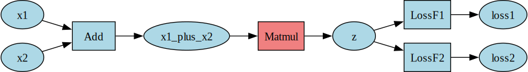

# Net Class
The `Net` class is a thin wrapper around connected `Data` and `Module` nodes that facilitates the
forward and backward passes amongst other functionalities.

The following visualization intuitively sums up the types of connections of a `Net` object:

    <picture>
        
    </picture>

 

To create a `Net` object one must first connect `Data` and `Module` nodes in the desired order and
then initialize the network by passing in the list of **root_nodes**, that is the nodes from which
backpropagation should begin.

The basic process of training requires:
1. Setting the **val** attribute of the input nodes.
2. Running the **forward()** pass.
3. Running the **backward()** pass.
4. Performing a network **update()**.

**Note:** Upon running update, the network automatically clears out the gradients of all the `Data`
nodes in the network. This is helpful when implementing RNNs as there the parameters are shared and
we want the parameter to receive only 1 update based on all accumulated gradients. If one is not
running update then before performing another backward pass one has to **clear_grads()** to prevent
erroneous accumulation of gradients.

A variant of the forward pass is the **forward_from_node()** which starts the forward pass from the
specified node. It calls the forward method of all the modules that occur after it in the
**topological_order**. Of course, this method requires that the value of the node is set separately
for the forward pass from it to be correct. This method is especially useful for implementing
gradient checking for the network.

We can **freeze()** or **unfreeze()** the network so that it does not receive updates any more. Note
that these methods only freeze or unfreeze all the `Module` objects in the network, changes for
`Data` objects have to be made manually by calling the specific `Data` object's corresponding
methods.

Some `Module` objects run **differently_at_train_test** and to account for that the `Net` mode has
to be specified appropriately by **set_mode()**.

One can get a visual representation of the network architecture by using **visualize()** which
creates a .pdf file with the drawing.

It is extremely easy to **save()** and **load()** models. DeepFusion uses the **.df** extension for
model files.

If one wishes to extend a pre-trained model one can use the **connect()** and **disconnect()**
features combined with the **freeze()** and **unfreeze()** features for customized training of
specific parts of the network.

RNN implementations and repeated use of same parameters at different places in the network requires
one to **share_parameters()** which shares the parameter memory across specified `Module` objects.

## Attributes
Based on these features a `Net` object has the following attributes:
|Attribute          |Type                         |
|-------------------|-----------------------------|
|ID                 |str                          |
|root_nodes         |list[Data]                   |
|learning_rate      |float                        |
|is_frozen          |bool                         |
|optimizer_details  |dict                         |
|is_regularized     |bool                         |
|regularizer_details|dict                         |
|available_modes    |list[str]                    |
|mode               |str                          |
|graph              |dict                         |
|graph_visual       |dict                         |
|topological_order  |list[Union[`Data`, `Module`]]|
|node_lookup        |dict                         |

## Methods
`Net` objects have the following methods defined:
- `__init__(self, ID, root_nodes, learning_rate=1e-6, optimizer_details=DEFAULT_OPTIMIZER_DETAILS,
  is_regularized=False, regularizer_details=None)`:
  Initializes the `Net` object.
- `get_node(self, ID)`: Returns the node corresponding to a particular ID.
- `forward(self, verbose=False)`: Runs the forward method of each module to perform the neural net
  forward pass.
- `backward(self, verbose=False)`: Runs the backward method of each module to perform the neural net
  backward pass.
- `forward_from_node(self, node)`: Runs the forward method starting from a particular node.
- `update(self)`: Updates all the parameters of each node in the neural network.
- `freeze(self)`: Freezes all the modules of the neural network.
- `unfreeze(self, optimizer_details=DEFAULT_OPTIMIZER_DETAILS)`: Unfreezes all the modules of the
  neural network.
- `clear_grads(self)`: Clears gradients for each node in the neural network.
- `set_learning_rate(self, learning_rate)`: Sets the learning rate for each node of the neural
  network.
- `set_optimizer(self, optimizer_details)`: Sets optimizer for all modules of the neural network.
- `set_regularization(self, regularizer_details)`: Sets regularizer details for all the regularized
  modules of the neural network.
- `set_mode(self, mode)`: Sets the mode (training/testing) for the neural network.
- `visualize(self, filename='Visualization', orientation='LR')`: Draws a graph to visualize the
  network.
- `save(self, file_path)`: Saves the `Net` object to a file.
- `load(file_path)`: Loads a saved `Net` object from a file.
- `connect(self, root_nodes)`: Reinitializes the network based on newly connected nodes and modules.
- `disconnect(self, data_obj, module_obj)`: Disconnects a data object and a module.
- `share_parameters(self, modules)`: Shares parameters across the modules.